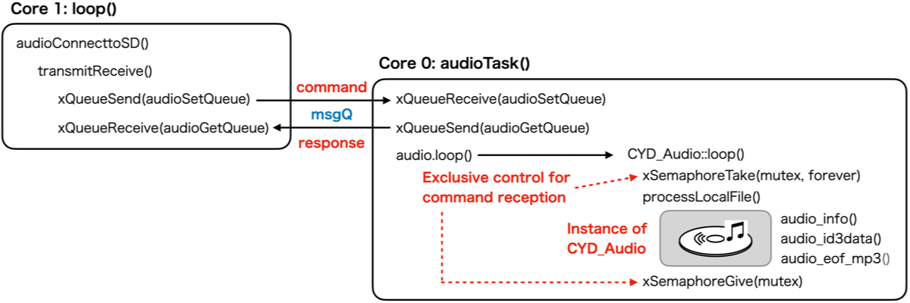

# Basic sketch to demonstrate how to use CYD_Audio library

## Basic sketch

```c++
#include "CYD28_audio.h"

void setup() {
  Serial.begin(115200);
  while (millis() < 1000);

  if (!SD.begin()) {
    Serial.println("Cannot begin SD.");
    while (1);
  }

  audioInit();  // Create a task to play audio file
  delay(10);    // Wait until the task on Core 1 is ready to receive a command
  audioConnecttoSD("/sample.mp3");
}

void loop() {
  if (Serial.available() > 0) {
    int v = Serial.readStringUntil('\n').toInt();
    audioSetVolume((uint8_t)constrain(v, 0, 21));
  }
}
```

## How it works

The function `audioInit()` creates the `audioplay` task on ESP32 core 0.

Core 1 can send commands to the `audioplay` task via a message queue.


