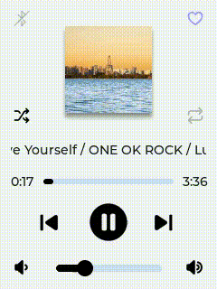
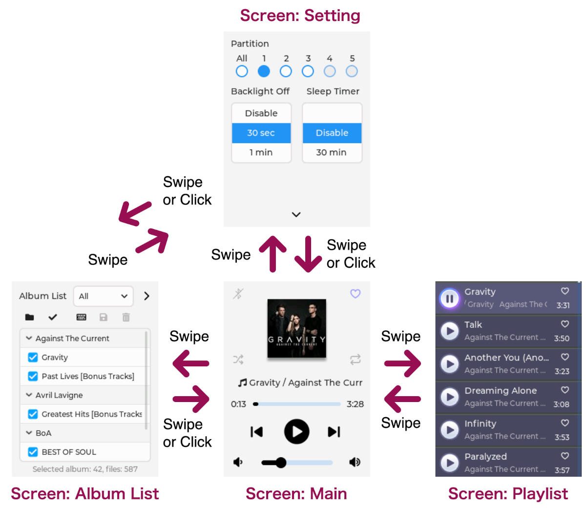

# CYD MP3 Music Player



## 1. Feature

- GUI by [LVGL][1]
- Internal DAC and onboard amplifier can directly drive a speaker connected to CYD
- Can manage approximately 3,000 music files [^1]
- Can display the cover photo for each album
- "**Playlist**" to display music titles, artist names, and album names
- "**Album List**" to manage the albums you want to play
- Heart-shaped "**Favorites**" button to play only selected files
- Power saving mode to turn off the LCD after a set time, and a sleep timer to shut down the device

## 2. Screens
<details>
<summary>Screen transition</summary>


</details>

- **Screen: Main**  
  Controls the playback of audio files included in the playlist.

- **Screen: Playlist**  
  A list of audio file titles, artists, and album names.

- **Screen: Album List**  
  Manages a list of albums that contain music files recorded on a single CD. Albums with a check mark will be included in the playlist.  
  
  In addition to the default list "All", you can create some new lists.

- **Screen: Setting**  
  The number of music files that can be included in a playlist is limited to approximately 600+α (α ≦ 25).
  
  By creating and switching between several subfolders (called "**Partition**" in this application) on the SD card, you can manage a total of over 3000 files.  
  
  You can also set the time until the backlight turns off and the sleep timer.

## 3. Software Requirements

### 3.1. Arduino IDE
| Name                       | Version      |
| -------------------------- | ------------ |
| Arduino IDE                | 2.3.4 and up |


### 3.2. Platform board package
| Name                       | Version     |
| -------------------------- | ----------- |
| esp32 by Espressif Systems | 2.0.17 [^2] |

Select [ESP32 Dev Module][2] as a board.

### 3.3. Libraries
| Name                                | Version      |
| ----------------------------------- | ------------ |
| [LVGL][4] by kisvegabor             | 9.2.2 and up |
| [LovyanGFX][5] by lovyan03          | 1.2.7        |
| [SdFat][6] by Bill Greiman          | 2.3.0        |
| [ArduinoJson][7] by Benoit Blanchon | 7.4.2        |

### 3.4. Library configuration

- **LVGL**  
  After installing LVGL, configure `lv_conf.h` by referring to the official document "[Configure LVGL][8]". Some samples of `lv_conf.h` for this application are provided in the [assets/lv_conf/](assets/lv_conf). For details, see [assets/lv_conf/README.md](assets/lv_conf/README.md).

- **SdFat**  
  To handle long filenames and multibyte characters, uncomment the definition of the symbol `USE_UTF8_LONG_NAMES` in [libraries/SdFat/src/SdFatConfig.h][9] under your sketchbook folder.

### 3.5. Custom Fonts
In addition to LVGL's fonts, this application embeds several national alphabets and symbols of **12px** and **14px**, as well as Japanese Kanji Level 1 and Level 2.

To create custom fonts, refer to [assets/fonts/README.md](assets/fonts/README.md) and use [LVGL Font Converter][10] to create/download the font data, save them to [src/](src), and modify [ui.h](ui.h#L18-L29).

## 4. Edit and Compile / Upload

### 4.1. Edit config.h

Open [`config.h`](config.h) in the Arduino IDE and follow the comments to modify the default settings as desired.

### 4.2. Compile / Upload
Set the following two items from the "**Tools**" menu in the Arduino IDE.

| Item             | Selection                              |
| ---------------- |--------------------------------------- |
| Partition Scheme | **"Huge App (3MB No OTA/1MB SPIFFS)"** |
| Upload Speed     | **"460800"** (Mac), **"921600"** (Win) |

## 5. How To Use
This application is designed to take albums ripped from CDs and save them directly to your SD card. In addition to `.mp3`, the `.m4a` and `.wav` audio file formats are supported.

**Note for Mac users:** If a large number of dot files are created on the SD card, it will take a long time to search for audio files. In order to avoid this, use the Terminal app to navigate to the directory containing the audio files (e.g. `NO NAME/MP3/`) and execute the following command to delete them.

```bash
% cd /Volumes/NO\ NAME/MP3/
% find . -name ".???*" -print -exec /bin/rm -rf {} \;
```

### 5.1. About "Partition"
Due to the SRAM capacity of MCU, if you plan to store a large number of albums, it is recommended that you create subfolders (up to 5) and limit the number of albums to arround 50 titles and the number of music files to arround 600+α, in each subfolder.

In this application, such subfolder is named as "Partition" and can be selected in the **"Setting"** screen.

### 5.2. Shuffle Mode
"**Shuffle**" works as bellow:

- (1) continues to randomly select and add albums to the playlist until the total number of music files exceeds 600+α
- (2) and finally randomly sorts the playlist again.

However, due to the "600+α" limitation for music files, when "**Shuffle**" is OFF, the behavior will differ depending on whether you select an individual partition or "**All**".

When you select an individual partition, albums will be added to the playlist in ascending order, but when you select "**All**", only (1) will be performed.

### 5.3. Album List
Pressing the "**Keyboard**" button under the dropdown will create an empty list, so enter a list name, close the keyboard, select the album you want to add, and finally press the "**Save**" button.


The "**Keyboard**" button is also used to edit an existing list.

### 5.4. Album Cover Photo
The "**Main Screen**" displays one of the 10 default images randomly. Besides the default image, you can put an album cover photo named `@photo.jpg` to your album folder.

Due to memory capacity limitations of the MCU, this `@photo.jpg` must be 96x96 and its size must be 6KB or less.

To generate the `@photo.jpg` image, use something like [GIMP][11] and it's good to set the compression rate to around 50-75%.

### 5.5. Backlight / Sleep Timer
The "**Backlight**" setting not only turns off the LCD illumination but also stops the clock to the LCD, reducing power consumption by approximately 40%.

The "**Sleep Timer**" will put the MCU into deep sleep mode after the set time has elapsed. To recover from this state, press the reset button or cycle the power.

### 5.6. Auto Saving
Some UI-related parameters (e.g. "**Shuffle**", "**Favorite**", "**Partition**", etc.) are automatically saved to the SD card between songs or when you pause playback, and are restored when you power cycle the device.

## 6. Known Issues

- Due to the exception handling for the `new` operator differs between the C++ Standard Template Library (STL) and SdFat, the following warning will be out during compilation, but this is not a problem for practical use.

```c++
/Users/xxxx/Documents/Arduino/libraries/SdFat/src/FsLib/FsNew.h:44:48: warning: optimization attribute on 'void* operator new(size_t, newalign_t*)' follows definition but the attribute doesn't match [-Wattributes]
 void* operator new(size_t size, newalign_t* ptr);
                                                ^
/Users/xxxx/Library/Arduino15/packages/esp32/tools/xtensa-esp32-elf-gcc/esp-2021r2-patch5-8.4.0/xtensa-esp32-elf/include/c++/8.4.0/new:168:14: note: previous definition of 'void* operator new(std::size_t, void*)' was here
 inline void* operator new(std::size_t, void* __p) _GLIBCXX_USE_NOEXCEPT
              ^~~~~~~~
```

- When using the built-in DAC and amplifier, there will be a "click" sound when powering up and when pausing/resume playback.

- The UI screen is designed for a 240x320 resolution only and is not responsive.

- It has been observed that `@photo.jpg` does not display depending on the tool that generates/compresses JPEG images. If the album cover photo is not displayed, please recreate it using [GIMP][11] or similar.

- The elapsed playing time is an estimate by the I2S audio library and may differ from the actual playing time. Please consider it as just a UI effect.

- "**Bluetooth**" icon at the top left on "**Main**" screen is not supported yet 😅

## 7. Credits
Thanks to the [ESP32 I2S audio library][14] in [hexeguitar/ESP32_TFT_PIO][15] (MIT license). This application includes a customized version of the `CYD_Audio` library.

Also thanks to the high quality photos under the [license by Unsplash][16].

- [Annie Spratt](https://unsplash.com/photos/a-red-brick-house-with-a-green-door-and-wreath-Wk7iG4QhFd8 "A red brick house with a green door and wreath. photo – Free Christmas Image on Unsplash")
- [Kailun Zhang](https://unsplash.com/photos/various-houseplants-displayed-on-white-shelves-faVRc372fCM "Various houseplants displayed on white shelves. photo – Free Interior design Image on Unsplash")
- [David Becker](https://unsplash.com/photos/snowy-landscape-with-a-lone-tree-at-sunset-HiOWmnLFTd8 "Snowy landscape with a lone tree at sunset. photo – Free Forest Image on Unsplash")
- [Doncoombez](https://unsplash.com/photos/a-duck-preening-itself-while-floating-on-water-b3Fse8sB4Ac "A duck preening itself while floating on water. photo – Free Animal Image on Unsplash")
- [Dzo](https://unsplash.com/photos/pink-lotus-flowers-floating-on-serene-water-at-sunrise-IEJqCs6JkDI "Pink lotus flowers floating on serene water at sunrise photo – Free Sunset Image on Unsplash")
- [Esra Afşar](https://unsplash.com/photos/a-latte-with-intricate-foam-art-on-a-saucer-qJMWQCq3ZJk "A latte with intricate foam art on a saucer photo – Free Coffee Image on Unsplash")
- [Grigorii Shcheglov](https://unsplash.com/photos/desk-with-globe-books-and-vintage-typewriter-_f5MgSSpuKQ "Desk with globe, books, and vintage typewriter. photo – Free Books Image on Unsplash")
- [Pranav Nav](https://unsplash.com/photos/clear-water-droplets-falling-onto-a-light-blue-podium-A3O1iXUQGR8 "Clear water droplets falling onto a light blue podium. photo – Free Abstract Image on Unsplash")
- [Rohit Choudhari](https://unsplash.com/photos/giant-ribcage-structure-in-a-pink-field-with-cherry-blossoms-Ph527s59P_M "Giant ribcage structure in a pink field with cherry blossoms photo – Free Digital image Image on Unsplash")
- [Vincent Tint](https://unsplash.com/photos/city-skyline-across-a-wide-body-of-water-hFQ39GIBPdI "City skyline across a wide body of water. photo – Free Sunset Image on Unsplash")

## 8. Have Fun!
If you find any issues or have suggestions, please report in [Issues][12] or [Discussions][13] 🥰

----------

[^1]: Estimated number of audio files that can be stored on a 32GB microSD card.

[^2]: In version 3.x, the I2S driver for the internal DAC is deprecated and does not work properly.

[1]: https://lvgl.io/ "LVGL — Light and Versatile Embedded Graphics Library"
[2]: https://github.com/espressif/arduino-esp32/tree/master/variants/esp32 "arduino-esp32/variants/esp32 at master · espressif/arduino-esp32"
[3]: https://github.com/espressif/arduino-esp32/tree/master/variants/jczn_2432s028r "arduino-esp32/variants/jczn_2432s028r at master · espressif/arduino-esp32"
[4]: https://github.com/lvgl/lvgl "lvgl/lvgl: Embedded graphics library to create beautiful UIs for any MCU, MPU and display type."
[5]: https://github.com/lovyan03/LovyanGFX "lovyan03/LovyanGFX: SPI LCD graphics library for ESP32 (ESP-IDF/ArduinoESP32) / ESP8266 (ArduinoESP8266) / SAMD51(Seeed ArduinoSAMD51)"
[6]: https://github.com/greiman/SdFat "greiman/SdFat: Arduino FAT16/FAT32 exFAT Library"
[7]: https://github.com/bblanchon/ArduinoJson "bblanchon/ArduinoJson: 📟 JSON library for Arduino and embedded C++. Simple and efficient."
[8]: https://docs.lvgl.io/master/integration/frameworks/arduino.html#configure-lvgl "Arduino - LVGL 9.5 documentation"
[9]: https://github.com/greiman/SdFat/blob/master/src/SdFatConfig.h#L34-L35 "SdFat/src/SdFatConfig.h at master · greiman/SdFat"
[10]: https://lvgl.io/tools/fontconverter "Font Converter — LVGL"
[11]: https://www.gimp.org/ "GIMP - GNU Image Manipulation Program"
[12]: https://github.com/embedded-kiddie/CYD_MP3Player/issues "embedded-kiddie/CYD_MP3Player · Issues · GitHub"
[13]: https://github.com/embedded-kiddie/CYD_MP3Player/discussions "embedded-kiddie/CYD_MP3Player · Discussions · GitHub"
[14]: https://github.com/hexeguitar/ESP32_TFT_PIO/tree/main/Examples/CYD28_BaseProject/lib/CYD_Audio "ESP32_TFT_PIO/Examples/CYD28_BaseProject/lib/CYD_Audio at main · hexeguitar/ESP32_TFT_PIO"
[15]: https://github.com/hexeguitar/ESP32_TFT_PIO "hexeguitar/ESP32_TFT_PIO: Example project for the ESP32-2432S028 &quot;Cheap Yellow Display&quot; board."
[16]: https://unsplash.com/license "License｜Unsplash"
