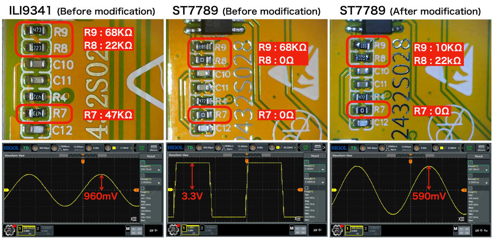

# CYD MP3 Music Player
MP3 music player for Cheap Yellow Display

## Library & Sketches

### [CYD_Audio](CYD_Audio)
CYD_Audio is an [ESP32 I2S audio library][0] by [Piotr Zapart][1], written for PlatformIO.

The version included here has been modified for Arduino so that it can be installed into the `libraries` folder in your Arduino sketchbook folder.

### [CYD_MP3Player_Basic](CYD_MP3Player_Basic)
This is a simple sketch that demonstrates how to use the CYD_Audio library. It plays a specified audio file stored on the SD card.

The helper class `CYD_Audio` also created by [Piotr Zapart][1] simplifies the use of the CYD_Audio library. It creates a task named `audioplay` on ESP32 core 0, and allows you to control playback, volume adjustment, etc. by sending messages to the `audioplay` task from core 1.

### [CYD_MP3Player_Simple](CYD_MP3Player_Simple)
This sketch is an example of applying the `CYD_Audio` wrapper class named `MP3Player` to scan the audio files on the SD card, create a playlist, and control the playback order.

### [CYD_MP3Player_LVGL](CYD_MP3Player_LVGL)
This version features a rich LVGL GUI that allows you to play and manage audio files, add favorites, and shuffle playback.

The `MP3Player` class has been extended to meet the requirements of UI components.

## Hardware modification

Although CYD has a speaker terminal, the sound quality is quite poor, so if you want to listen to music properly, you will need to improve the hardware.

### Use Internal DAC and Onboard Amplifier
The circuitry around the onboard audio amplifier (SB8002B) requires to adjust the amplifier gain by changing the associated resistors.

<details>
<summary>ILI9341/ST7789 and amplifier IC SC8002B schematics</summary>


</details>

The following links are good resources to help you solve this problem.

- [Audio amp gain mod - ESP32-2432S028 aka Cheap Yellow Display example project][2].
- [ESP32-2432S028 aka Cheap Yellow Display - fixing the audio issues - YouTube][3]

Even when I changed the resistors of ST7789 to the same as ILI9341, the high frequencies were crushed and the sound became rough, making it unsuitable for listening to the music, so I ended up doing the following:

#### ILI9341 modification
<details>
<summary>Decrease the resistance value of R9</summary>


</details>

#### ST7789 modification
<details>
<summary>Replace resistors R8 and R9</summary>

| Resister | Before modification | After modification |
| :------: | ------------------: | -----------------: |
| R7       | 0 Ω                 | 0 Ω                |
| R8       | 0 Ω                 | 22 KΩ              |
| R9       | 68 KΩ               | 10 KΩ              |
</details>

#### 440 Hz/sine wave sound test
<details>
<summary>Oscilloscope observation results</summary>




</details>

The results show that the audio amplifier IC SC8002B is not suitable for music playback.

### Use External DAC and Amplifier
The links below explain how to connect external DAC modules.

- [Audio I2S mod - ESP32-2432S028 aka Cheap Yellow Display example project][4]
- [CYD’s Note 2025 - macsbug][5]

In this case, please define the symbol `USE_I2S_DAC` and each pin appropriately in [audioTask() in CYD28_audio.cpp](CYD28_audio.cpp#L35-L43).

```c++
void audioTask(void *parameter)
{
    // if using the I2S mod, RGB led is removed, I2S pinout defined in platformio.ini file
#ifdef USE_I2S_DAC
    audio.begin();
    audio.setPinout(I2S_BCK_PIN, I2S_LRCLK_PIN, I2S_DIN_PIN);
#else
    audio.begin(true, I2S_DAC_CHANNEL_LEFT_EN);
#endif
...
}
```

## Special Thanks
- [hexeguitar/ESP32_TFT_PIO][1] (published under the MIT license)

[0]: https://github.com/hexeguitar/ESP32_TFT_PIO/tree/main/Examples/CYD28_BaseProject/lib/CYD_Audio "ESP32_TFT_PIO/Examples/CYD28_BaseProject/lib/CYD_Audio at main · hexeguitar/ESP32_TFT_PIO"
[1]: https://github.com/hexeguitar "hexeguitar (Piotr Zapart)"
[2]: https://github.com/hexeguitar/ESP32_TFT_PIO?tab=readme-ov-file#audio-amp-gain-mod "hexeguitar/ESP32_TFT_PIO: Example project for the ESP32-2432S028 &quot;Cheap Yellow Display&quot; board."
[3]: https://www.youtube.com/watch?v=6JCLHIXXVus "ESP32-2432S028 aka Cheap Yellow Display - fixing the audio issues - YouTube"
[4]: https://github.com/hexeguitar/ESP32_TFT_PIO?tab=readme-ov-file#audio-i2s-mod "hexeguitar/ESP32_TFT_PIO: Example project for the ESP32-2432S028 &quot;Cheap Yellow Display&quot; board."
[5]: https://macsbug.wordpress.com/2025/04/18/cyds-note-2025/ "CYD&#8217;s Note 2025 | macsbug"
