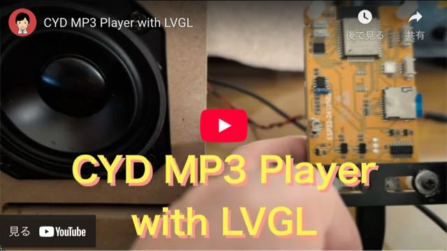
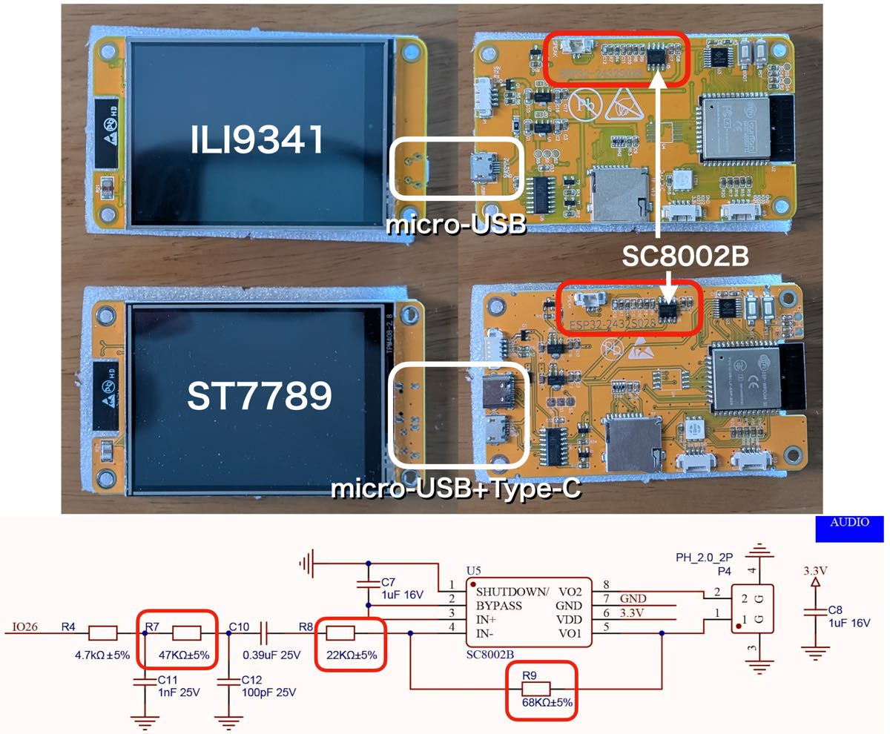
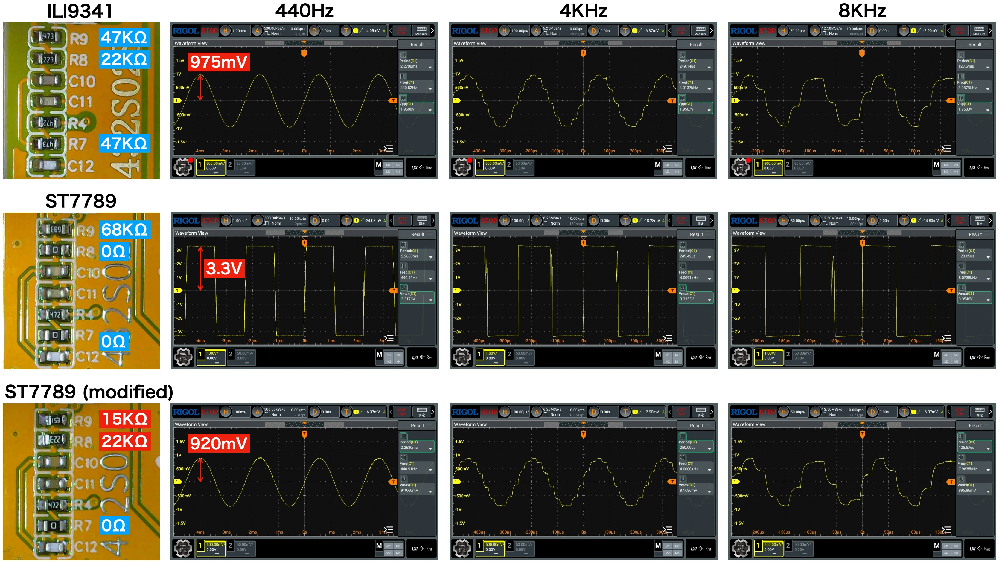

# CYD MP3 Music Player
MP3 music player for Cheap Yellow Display

## Library & Sketches

### [CYD_Audio](CYD_Audio)
CYD_Audio is an [ESP32 I2S audio library][2] based on [schreibfaul1/ESP32-audioI2S][1] and customized by [Piotr Zapart][3] for the CYD with an internal DAC and onboard amplifier IC.

Originally written for PlatformIO, the version included here has been modified for the Arduino IDE and can be installed in the `libraries` folder within your Arduino sketchbook folder.

#### Note
This library works fine with ESP32 core version 2.0.17, but [in 3.x the I2S driver][9] has been [completely redesigned and refactored to use the new ESP-IDF driver][10], which deprecates some functions and causes issues such as clicking noises.

### [CYD_MP3Player_Basic](CYD_MP3Player_Basic)
This is a simple sketch that demonstrates how to use the CYD_Audio library. It plays a specified audio file stored on the SD card.

CYD28_audio.[ch] defines helper functions for creating an instance of the CYD_Audio class on Core 1, making it easy to create a GUI loop that runs on Core 0.

This example creates a task named `audioplay` on core 0 with a predefined set of commands, and allows core 1 to send messages to it to control playback, volume adjustment, etc.

### [CYD_MP3Player_Simple](CYD_MP3Player_Simple)
This sketch is an example of applying the `CYD_Audio` wrapper class named `MP3Player` to scan the audio files on the SD card, create a playlist, and control continuous playback in a set order.

### [CYD_MP3Player_LVGL](CYD_MP3Player_LVGL)
[](https://youtu.be/sG8XH6JwQDA "")

This version features a rich LVGL GUI that allows you to play and manage audio files, add favorites, and shuffle playback.

The `MP3Player` class has been extended to meet the requirements of UI components.

## Hardware modification

Although CYD has a speaker terminal, the sound quality is quite poor, so if you want to listen to music properly, you will need to improve the hardware.

### Use Internal DAC and Onboard Amplifier
The circuitry around the onboard audio amplifier (SB8002B) requires to adjust the amplifier gain by changing the associated resistors.

<details>
<summary>ILI9341/ST7789 and amplifier IC SC8002B schematics</summary>


</details>

The resistor settings around the SC8002B on the ST7789 type CYD are very different from those on the ILI9341, and the gain is too high, resulting in terribly poor sound quality.

The following links are good resources to help you solve this problem.

- [Audio amp gain mod - ESP32-2432S028 aka Cheap Yellow Display example project][4].
- [ESP32-2432S028 aka Cheap Yellow Display - fixing the audio issues - YouTube][5]

#### Alternatives to ST7789 type modification
By simply replacing two resistors, you can get almost the same output as the ILI9341 type with the following settings:



| Resister | Before modification | After modification |
| :------: | ------------------: | -----------------: |
| R7       | 0 Ω                 | 0 Ω                |
| R8       | 0 Ω                 | 22 KΩ              |
| R9       | 68 KΩ               | 15 KΩ              |

### Use External DAC and Amplifier
The links below explain how to connect external DAC modules.

- [Audio I2S mod - ESP32-2432S028 aka Cheap Yellow Display example project][6]

In this case, please define the symbol `USE_I2S_DAC` and each pin appropriately in [audioTask() in CYD28_audio.cpp](/CYD_MP3Player_LVGL/CYD28_audio.cpp#L35-L43).

```c++
void audioTask(void *parameter)
{
    // if using the I2S mod, RGB led is removed, I2S pinout defined in platformio.ini file
#ifdef USE_I2S_DAC
    audio.begin();
    audio.setPinout(I2S_BCK_PIN, I2S_LRCLK_PIN, I2S_DIN_PIN);
#else
    audio.begin(true, I2S_DAC_CHANNEL_LEFT_EN);
#endif
...
}
```

where:

| Symbol          | Value |
| --------------- | -----:|
| `I2S_BCK_PIN`   | 4     |
| `I2S_LRCLK_PIN` | 22    |
| `I2S_DIN_PIN`   | 27    |

Similar modifications can also be found at the following site:

- [CYD’s Note 2025 - macsbug][7]

## Special Thanks
- [ESP32 I2S audio library][2] by [hexeguitar/ESP32_TFT_PIO][8] (MIT license).

[1]: https://github.com/schreibfaul1/ESP32-audioI2S "schreibfaul1/ESP32-audioI2S: Play mp3 files from SD via I2S"
[2]: https://github.com/hexeguitar/ESP32_TFT_PIO/tree/main/Examples/CYD28_BaseProject/lib/CYD_Audio "ESP32_TFT_PIO/Examples/CYD28_BaseProject/lib/CYD_Audio at main · hexeguitar/ESP32_TFT_PIO"
[3]: https://github.com/hexeguitar "hexeguitar (Piotr Zapart)"
[4]: https://github.com/hexeguitar/ESP32_TFT_PIO?tab=readme-ov-file#audio-amp-gain-mod "hexeguitar/ESP32_TFT_PIO: Example project for the ESP32-2432S028 &quot;Cheap Yellow Display&quot; board."
[5]: https://www.youtube.com/watch?v=6JCLHIXXVus "ESP32-2432S028 aka Cheap Yellow Display - fixing the audio issues - YouTube"
[6]: https://github.com/hexeguitar/ESP32_TFT_PIO?tab=readme-ov-file#audio-i2s-mod "hexeguitar/ESP32_TFT_PIO: Example project for the ESP32-2432S028 &quot;Cheap Yellow Display&quot; board."
[7]: https://macsbug.wordpress.com/2025/04/18/cyds-note-2025/ "CYD&#8217;s Note 2025 | macsbug"
[8]: https://github.com/hexeguitar/ESP32_TFT_PIO "hexeguitar/ESP32_TFT_PIO: Example project for the ESP32-2432S028 &quot;Cheap Yellow Display&quot; board."
[9]: https://docs.espressif.com/projects/arduino-esp32/en/latest/api/i2s.html "I2S -  -  &mdash; Arduino ESP32 latest documentation"
[10]: https://docs.espressif.com/projects/arduino-esp32/en/latest/migration_guides/2.x_to_3.0.html#i2s "Migration from 2.x to 3.0 -  -  &mdash; Arduino ESP32 latest documentation"
